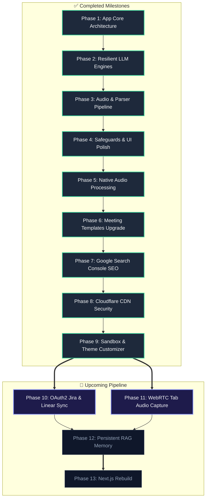

# Master Roadmap & Implementation Plan History

This directory contains versioned folders documenting each major update deployed to Kall AI.

---

## 🗺️ Master Visual Roadmap Flowchart

### Mermaid Flowchart Code

## 🛠️ Roadmap Specifications

| Phase | Title | Scope & Details | Status | Completed Date |
| :--- | :--- | :--- | :--- | :--- |
| **Phase 1** | App Core Architecture | Streamlit Cockpit UI & configuration | **Complete** | June 8, 2026 |
| **Phase 2** | Resilient LLM Engines | Dual provider support (Gemini & Claude) | **Complete** | June 9, 2026 |
| **Phase 3** | Audio & Parser Pipeline | Native large audio uploads (Gemini Files API) | **Complete** | June 10, 2026 |
| **Phase 4** | Safeguards & UI Polish | Engine capability markers (Audio & Text vs Text Only) | **Complete** | June 11, 2026 |
| **Phase 5** | Native Audio Processing | Resumable background uploads for large audio files | **Complete** | June 17, 2026 |
| **Phase 6** | Meeting Templates & Notepad Upgrade | Consolidated 1:1 and General Business templates | **Complete** | June 20, 2026 |
| **Phase 7** | Google Search Console & Technical SEO | Verified domain ownership via HTML meta tags | **Complete** | June 22, 2026 |
| **Phase 8** | Cloudflare CDN & DNS Security | Deployed Cloudflare CNAME WAF proxy for app subdomain, configured active WAF rate limiting (5 req/10s per IP), enforced SSL Edge redirection & DMARC txt records, and stitched high-res vertical uploader before/after banner. | **Complete** | June 23, 2026 |
| **Phase 9** | Jira Sync & Theme Customization | Passwordless Sandbox Simulation Mode, 4-Theme Picker Modal, brand logo x=24px, Settings label, FAB Help, crisp edges | **Complete** | June 25, 2026 |
| **Phase 10** | Jira & Linear OAuth2 Sync | Export Pydantic-parsed action items directly to active Jira Cloud and Linear backlogs. | **Up Next** | Planned |
| **Phase 11** | WebRTC Tab Capture | Record system and browser tab audio directly from the Chrome webpage without bots. | **Up Next** | Planned |
| **Phase 12** | Persistent RAG Memory | Add a persistent dashboard sidebar for past sessions and a search chat assistant. | Planned | Planned |
| **Phase 13** | Next.js SaaS Rebuild | Rebuild frontend in Next.js + Tailwind for sub-second responses and SaaS-grade UI. | Planned | Planned |
