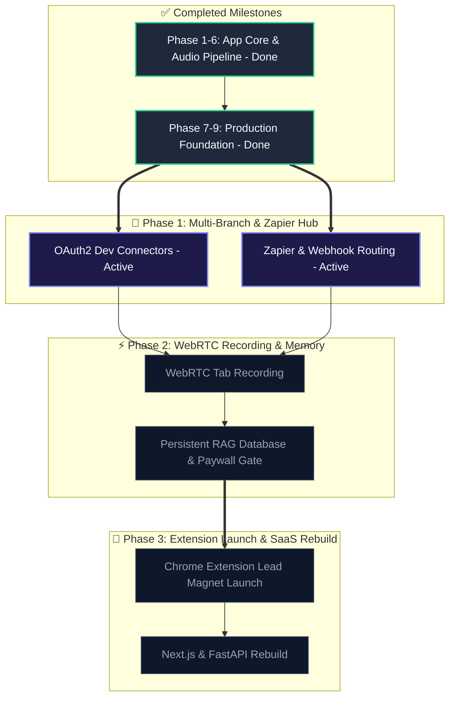

# Kall AI: Next-Level Product Pivot & Multi-Branch Roadmap

To stand out in the crowded 2026 AI productivity space, **Kall AI is transitioning from a generic meeting summarizer into a universal "Speech-to-Action Engine."**

Instead of limiting the product to developers and Jira, we are expanding it to support multiple target profiles. The core technology parses unstructured conversations and records, extracts structured data schemas via dynamic Pydantic definitions, and routes them to user-defined software platforms.

---

## 🧭 The 4 Product Branches

Kall AI will offer four distinct "Workspace Modes," each tailored to a specific professional workflow:

1.  **💻 Developer & Product PM Branch (Dev-to-Task)**
    *   **Workflow**: Converts sprint planning and standups into engineering backlogs.
    *   **Outputs**: Jira tickets, Linear issues, GitHub issues, branch naming conventions, story points.
2.  **🎙️ Personal Dictation & Idea Branch (Voice-to-Life)**
    *   **Workflow**: Transforms messy voice memos, stream-of-consciousness, or driving notes into clean, structured notes.
    *   **Outputs**: Notion pages, Todoist tasks, Google/Apple calendar events, sorted markdown lists.
3.  **🤝 SDR & Customer Success Branch (Call-to-CRM)**
    *   **Workflow**: Captures client discovery or support check-in calls.
    *   **Outputs**: HubSpot/Salesforce logs, automated client follow-up email drafts.
4.  **💼 Consultant & Agency Owner Branch (Scope-to-Contract)**
    *   **Workflow**: Transcribes project onboarding or scoping discussions.
    *   **Outputs**: Statement of Work (SOW) PDF drafts, Stripe invoice drafts with line items.

---

## 🚀 The Multi-Branch Roadmap

### Phase 10: Production OAuth2 Integrations (Complete)
*   **Jira, Linear & GitHub Connectors**: Authenticate developer accounts and export tickets directly to backlogs.
*   **Zapier / Make.com Webhook Hub**: Integrate a generic webhook endpoint. This unlocks integrations with **Notion, HubSpot, Todoist, and Stripe** immediately with zero custom backend logic.

### Phase 11: Bot-Free WebRTC Browser Audio Capture (Up Next)
*   **Tab & System Audio Recording**: Allow users to capture Google Meet or Zoom audio directly from their Chrome tab without installing plugins or inviting recording bots.

### Phase 12: Persistent Workspace Library & RAG Search (In Progress - Active) (Payment Gateway Introduced Here)
*   **Sidebar Session History**: Store past meeting logs in Supabase / PostgreSQL.
*   **Cross-Meeting Copilot**: Search and query across all history (e.g. *"What deliverables did we promise John last month?"*).
*   **Stripe Subscription Checkout**: Introduce the **Pro Tier** ($19/mo) gating persistent database storage and RAG search history.

### Phase 13: Chrome Extension Lead Magnet Launch
*   **LinkedIn Analytics Exporter**: Package and publish the `kall-linkedin-exporter.zip` Chrome Extension publicly. Use it as a free marketing lead magnet to drive content creators, agency leads, and founders to Kall AI.

### Phase 14: Next.js + FastAPI SaaS Overhaul
*   **Next.js Frontend**: Snappy React interface to replace Streamlit, allowing collaborative editing of tasks and drafts before exporting them.
*   **FastAPI Backend**: Python-based API service to handle audio transcription, Pydantic parsing, and webhook routing.

---

## 🗺️ Visual Flowchart

