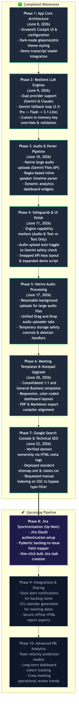

# Kall AI: Premium Feature Roadmap

You are exactly right—we don't have these features *yet*. But that is the beauty of a waitlist! You sell the vision on the landing page, get people excited to sign up, and then we build these features out while they wait. 

Here is exactly how we will build them, what tools we need to add to your current stack, and what it will cost you.

## 1. One-Click Jira / Linear Sync
* **How we build it:** We will add standard API calls to the backend of your Python Streamlit app. When a user clicks "Sync", your app will take the JSON output from Pydantic and send a `POST` request directly to Jira.
* **New Tools Needed:** Just two free Python libraries (`atlassian-python-api` and `requests`).
* **Cost to You:** **$0.** Connecting to Jira's API is completely free for developers.

## 2. Private User Accounts & Meeting Library
* **How we build it:** Right now, your app forgets everything when the browser closes. We need to add an Authentication system (to log users in) and a Database (to save their past transcripts).
* **New Tools Needed:** **Firebase**. We will integrate Firebase Authentication (for Google Sign-in) and Firebase Firestore (a NoSQL database) into your Streamlit app. I noticed we already have the Firebase SDKs drafted in your landing page HTML!
* **Cost to You:** **$0.** Firebase has a highly generous "Spark" Free Tier. You can store 1GB of database text and have up to 50,000 users logging in every month without paying a single cent.

## 3. Custom Schemas & Team Templates
* **How we build it:** We will add a "Settings" tab in your Streamlit app. Users can type in the specific fields they want extracted (e.g., "Add a field for T-Shirt Size"). We will use Python to dynamically generate a new Pydantic schema on the fly based on their settings, and feed that to Gemini.
* **New Tools Needed:** None. We already have Streamlit and Pydantic.
* **Cost to You:** **$0.**

## 4. Massive Audio Limits (2-Hour Meetings)
* **How we build it:** The Gemini 1.5 Pro model you are already using actually supports massive 2-million token context windows. However, Streamlit struggles to upload massive 500MB video/audio files directly through the browser. We will add a feature to upload the raw audio to Firebase Storage first, and then send the storage link to Gemini for processing.
* **New Tools Needed:** Firebase Storage (for temporarily holding the large audio files).
* **Cost to You:** **$0 to start.** Firebase Storage gives you 5GB of free storage. 

---

### Total Stack Review & Final Costs

Right now, your entire application is capable of running for **essentially $0 per month**.

| Tool | Purpose | Cost |
| :--- | :--- | :--- |
| **Streamlit / GitHub** | App Hosting & UI | $0 (Free forever) |
| **Cloudflare Pages** | Landing Page Hosting | $0 (Free forever) |
| **Firebase** | User Logins & Database | $0 (Free until you hit ~50k monthly active users) |
| **Jira / Linear APIs** | Ticket Syncing | $0 |
| **Google Gemini API** | AI Extraction Engine | **Free Tier:** 15 requests per minute. **Paid Tier:** If you get hundreds of users processing massive audio files every day, you switch to pay-as-you-go (Roughly $0.05 to $0.10 per large meeting). |

**The Strategy:** We can build **100% of this roadmap using your existing tools plus Firebase**. You will incur zero fixed monthly server costs. You only start paying pennies to Google for API usage *after* you have tons of active users, at which point you will be charging them a monthly subscription fee!

---

### 🚀 Future Vision: Premium UI Overhaul (Post-100 Users)

Once Kall AI reaches **100+ active waitlist users**, we should consider transitioning from Streamlit to a professional frontend stack (**Next.js + Tailwind CSS** running on a **FastAPI** Python backend). This will unlock:
*   **Pixel-Perfect Design Control:** Replicating custom glassmorphism cards, animations, and custom sidebars seamlessly.
*   **Sub-Second Load Times:** Eliminating Streamlit's full-page refresh lag on button clicks.
*   **Production-Grade Scaling:** Allowing you to sell a premium-feeling enterprise suite that commands higher subscription values.

---

## 🗺️ Visual Roadmap Flowchart (Status as of Version 7)

### Mermaid Flowchart Code

```mermaid
graph TD
    %% Define Styles
    classDef done fill:#1e293b,stroke:#34d399,stroke-width:2px,color:#f8fafc;
    classDef current fill:#1e1b4b,stroke:#818cf8,stroke-width:2px,color:#f8fafc;
    classDef next fill:#0f172a,stroke:#475569,stroke-width:1px,color:#94a3b8;

    subgraph Completed["✅ Completed Milestones"]
        M1["Phase 1: App Core Architecture<br/>(June 8, 2026)<br/>- Streamlit Cockpit UI & configuration<br/>- Dark-mode glassmorphic theme styling<br/>- Demo transcript loader integration"]:::done
        M2["Phase 2: Resilient LLM Engines<br/>(June 9, 2026)<br/>- Dual provider support (Gemini & Claude)<br/>- Gemini fallback loop (2.5-Pro -> Flash -> 3.1-Lite)<br/>- Custom in-memory key overrides & validation"]:::done
        M3["Phase 3: Audio & Parser Pipeline<br/>(June 10, 2026)<br/>- Native large audio uploads (Gemini Files API)<br/>- Regex-based inline speaker timeline parser<br/>- Dynamic analytics dashboard widgets"]:::done
        M4["Phase 4: Safeguards & UI Polish<br/>(June 11, 2026)<br/>- Engine capability markers (Audio & Text vs Text Only)<br/>- Audio upload auto-toggle to Gemini safety check<br/>- Swapped API keys layout & expanded demo script"]:::done
        M5["Phase 5: Native Audio Processing<br/>(June 17, 2026)<br/>- Resumable background uploads for large audio files<br/>- Unified Drag-and-Drop audio uploader tabs<br/>- Temporary storage safety controls & deletion handlers"]:::done
        M6["Phase 6: Meeting Templates & Notepad Upgrade<br/>(June 20, 2026)<br/>- Consolidated 1:1 and General Business templates<br/>- Responsive, color-coded dashboard layouts<br/>- PDF & Markdown export compiler alignment"]:::done
        M7["Phase 7: Google Search Console & Technical SEO<br/>(June 22, 2026)<br/>- Verified domain ownership via HTML meta tags<br/>- Deployed standard sitemap.xml & robots.txt<br/>- Requested manual indexing on GSC to bypass typo-filter"]:::done
    end

    subgraph Pipeline["🚀 Upcoming Pipeline"]
        N1["Phase 8: Jira Synchronization (Up Next)<br/>- Jira OAuth authentication setup<br/>- Pydantic backlog-to-issue field mapper<br/>- One-click bulk Jira task creation"]:::current
        N2["Phase 9: Integrations & Sharing<br/>- Slack alert notifications for backlog items<br/>- ICS calendar generation for meeting dates<br/>- Secure offline HTML report exports"]:::next
        N3["Phase 10: Advanced PM Analytics<br/>- Team velocity prediction models<br/>- Long-term dashboard cohort tracking<br/>- Cross-meeting operational review trends"]:::next
    end

    M1 --> M2
    M2 --> M3
    M3 --> M4
    M4 --> M5
    M5 --> M6
    M6 --> M7
    M7 ==> N1
    N1 --> N2
    N2 --> N3
```

## 🛠️ Roadmap Specifications

| Phase | Title | Scope & Details | Status | Completed Date |
| :--- | :--- | :--- | :--- | :--- |
| **Phase 1** | App Core Architecture | Streamlit Cockpit UI & configuration | **Complete** | June 8, 2026 |
| **Phase 2** | Resilient LLM Engines | Dual provider support (Gemini & Claude) | **Complete** | June 9, 2026 |
| **Phase 3** | Audio & Parser Pipeline | Native large audio uploads (Gemini Files API) | **Complete** | June 10, 2026 |
| **Phase 4** | Safeguards & UI Polish | Engine capability markers (Audio & Text vs Text Only) | **Complete** | June 11, 2026 |
| **Phase 5** | Native Audio Processing | Resumable background uploads for large audio files | **Complete** | June 17, 2026 |
| **Phase 6** | Meeting Templates & Notepad Upgrade | Consolidated 1:1 and General Business templates | **Complete** | June 20, 2026 |
| **Phase 7** | Google Search Console & Technical SEO | Verified domain ownership via HTML meta tags | **Complete** | June 22, 2026 |
| **Phase 8** | Jira Synchronization | Jira OAuth authentication setup | **Up Next** | Planned |
| **Phase 9** | Integrations & Sharing | Slack alert notifications for backlog items | Planned | Planned |
| **Phase 10** | Advanced PM Analytics | Team velocity prediction models | Planned | Planned |

