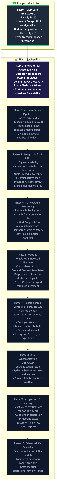

# Phase 1 Summary: App Core Architecture
- **Date**: June 8, 2026
- **Status**: Completed

## Milestones Achieved:
- Streamlit Cockpit UI & session state configuration.
- Dark-mode glassmorphic theme styling foundation.
- Demo transcript loader integration.

---

## 🗺️ Visual Roadmap Flowchart (Status as of Version 1)

### Mermaid Flowchart Code

```mermaid
graph TD
    %% Define Styles
    classDef done fill:#1e293b,stroke:#34d399,stroke-width:2px,color:#f8fafc;
    classDef current fill:#1e1b4b,stroke:#818cf8,stroke-width:2px,color:#f8fafc;
    classDef next fill:#0f172a,stroke:#475569,stroke-width:1px,color:#94a3b8;

    subgraph Completed["✅ Completed Milestones"]
        M1["Phase 1: App Core Architecture<br/>(June 8, 2026)<br/>- Streamlit Cockpit UI & configuration<br/>- Dark-mode glassmorphic theme styling<br/>- Demo transcript loader integration"]:::done
    end

    subgraph Pipeline["🚀 Upcoming Pipeline"]
        M2["Phase 2: Resilient LLM Engines (Up Next)<br/>- Dual provider support (Gemini & Claude)<br/>- Gemini fallback loop (2.5-Pro -> Flash -> 3.1-Lite)<br/>- Custom in-memory key overrides & validation"]:::current
        M3["Phase 3: Audio & Parser Pipeline<br/>- Native large audio uploads (Gemini Files API)<br/>- Regex-based inline speaker timeline parser<br/>- Dynamic analytics dashboard widgets"]:::next
        M4["Phase 4: Safeguards & UI Polish<br/>- Engine capability markers (Audio & Text vs Text Only)<br/>- Audio upload auto-toggle to Gemini safety check<br/>- Swapped API keys layout & expanded demo script"]:::next
        M5["Phase 5: Native Audio Processing<br/>- Resumable background uploads for large audio files<br/>- Unified Drag-and-Drop audio uploader tabs<br/>- Temporary storage safety controls & deletion handlers"]:::next
        M6["Phase 6: Meeting Templates & Notepad Upgrade<br/>- Consolidated 1:1 and General Business templates<br/>- Responsive, color-coded dashboard layouts<br/>- PDF & Markdown export compiler alignment"]:::next
        M7["Phase 7: Google Search Console & Technical SEO<br/>- Verified domain ownership via HTML meta tags<br/>- Deployed standard sitemap.xml & robots.txt<br/>- Requested manual indexing on GSC to bypass typo-filter"]:::next
        N1["Phase 8: Jira Synchronization<br/>- Jira OAuth authentication setup<br/>- Pydantic backlog-to-issue field mapper<br/>- One-click bulk Jira task creation"]:::next
        N2["Phase 9: Integrations & Sharing<br/>- Slack alert notifications for backlog items<br/>- ICS calendar generation for meeting dates<br/>- Secure offline HTML report exports"]:::next
        N3["Phase 10: Advanced PM Analytics<br/>- Team velocity prediction models<br/>- Long-term dashboard cohort tracking<br/>- Cross-meeting operational review trends"]:::next
    end

    M1 ==> M2
    M2 --> M3
    M3 --> M4
    M4 --> M5
    M5 --> M6
    M6 --> M7
    M7 --> N1
    N1 --> N2
    N2 --> N3
```

## 🛠️ Roadmap Specifications

| Phase | Title | Scope & Details | Status | Completed Date |
| :--- | :--- | :--- | :--- | :--- |
| **Phase 1** | App Core Architecture | Streamlit Cockpit UI & configuration | **Complete** | June 8, 2026 |
| **Phase 2** | Resilient LLM Engines | Dual provider support (Gemini & Claude) | **Up Next** | Planned |
| **Phase 3** | Audio & Parser Pipeline | Native large audio uploads (Gemini Files API) | Planned | Planned |
| **Phase 4** | Safeguards & UI Polish | Engine capability markers (Audio & Text vs Text Only) | Planned | Planned |
| **Phase 5** | Native Audio Processing | Resumable background uploads for large audio files | Planned | Planned |
| **Phase 6** | Meeting Templates & Notepad Upgrade | Consolidated 1:1 and General Business templates | Planned | Planned |
| **Phase 7** | Google Search Console & Technical SEO | Verified domain ownership via HTML meta tags | Planned | Planned |
| **Phase 8** | Jira Synchronization | Jira OAuth authentication setup | Planned | Planned |
| **Phase 9** | Integrations & Sharing | Slack alert notifications for backlog items | Planned | Planned |
| **Phase 10** | Advanced PM Analytics | Team velocity prediction models | Planned | Planned |

