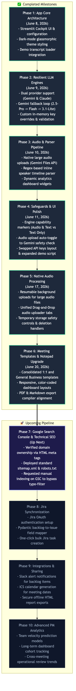

# Release v3.0.0 - Meeting Templates & Notepad Upgrade 🚀

We are excited to release **v3.0.0** of the GenAI Meeting Summarizer & Operations Cockpit! This release introduces structured template expansions and a completely redesigned ingestion console to reduce cognitive load and simplify call uploads.

## 🎙️ What's New

### 1. Expanded Meeting Templates
* **1:1 Alignment & Feedback**: Added a customized template featuring reciprocal goals, performance/alignment feedback tracking, and personal action commitments.
* **General Business Sync**: Added an organizational briefing template tracking updates, announcements, and open Q&A discussion threads.
* **Refined Schema & Prompts**: Updated underlying Pydantic schemas and instructions to cleanly prompt Gemini and Claude to extract relevant fields depending on the active template.

### 🎨 2. Dual-Card Ingestion Console (UI/UX Redesign)
* **Side-by-Side Panels**: Replaced the single-column vertical layout with a balanced 50/50 horizontal split. Setup (context, host, templates, notes) is housed in the left card; Ingestion & file uploads are housed in the right card.
* **Progressive Disclosure**: Advanced configurations (LLM models, API keys) are now hidden within an expander to maintain a clean layout height.
* **Browser MIME-Type Fix**: Corrected base64 image encoding for `favicon.png` (mapped from PNG to JPEG), restoring official logo visibility across all major web browsers.

### 📄 3. Enhanced Document Exporters
* **PDF Exporter**: Updated dynamic canvas rendering to support custom template fields (1:1 sections and announcement grids).
* **Markdown Brief Compiler**: Compiles updates, discussion logs, and career alignment details cleanly.

### 🧪 4. Quality & Robustness
* Added complete unit test suites checking all 5 template types.
* Integrated automated schema parsing and validation checks.

---

## 🗺️ Visual Roadmap Flowchart (Status as of Version 6)

### Mermaid Flowchart Code

```mermaid
graph TD
    %% Define Styles
    classDef done fill:#1e293b,stroke:#34d399,stroke-width:2px,color:#f8fafc;
    classDef current fill:#1e1b4b,stroke:#818cf8,stroke-width:2px,color:#f8fafc;
    classDef next fill:#0f172a,stroke:#475569,stroke-width:1px,color:#94a3b8;

    subgraph Completed["✅ Completed Milestones"]
        M1["Phase 1: App Core Architecture<br/>(June 8, 2026)<br/>- Streamlit Cockpit UI & configuration<br/>- Dark-mode glassmorphic theme styling<br/>- Demo transcript loader integration"]:::done
        M2["Phase 2: Resilient LLM Engines<br/>(June 9, 2026)<br/>- Dual provider support (Gemini & Claude)<br/>- Gemini fallback loop (2.5-Pro -> Flash -> 3.1-Lite)<br/>- Custom in-memory key overrides & validation"]:::done
        M3["Phase 3: Audio & Parser Pipeline<br/>(June 10, 2026)<br/>- Native large audio uploads (Gemini Files API)<br/>- Regex-based inline speaker timeline parser<br/>- Dynamic analytics dashboard widgets"]:::done
        M4["Phase 4: Safeguards & UI Polish<br/>(June 11, 2026)<br/>- Engine capability markers (Audio & Text vs Text Only)<br/>- Audio upload auto-toggle to Gemini safety check<br/>- Swapped API keys layout & expanded demo script"]:::done
        M5["Phase 5: Native Audio Processing<br/>(June 17, 2026)<br/>- Resumable background uploads for large audio files<br/>- Unified Drag-and-Drop audio uploader tabs<br/>- Temporary storage safety controls & deletion handlers"]:::done
        M6["Phase 6: Meeting Templates & Notepad Upgrade<br/>(June 20, 2026)<br/>- Consolidated 1:1 and General Business templates<br/>- Responsive, color-coded dashboard layouts<br/>- PDF & Markdown export compiler alignment"]:::done
    end

    subgraph Pipeline["🚀 Upcoming Pipeline"]
        M7["Phase 7: Google Search Console & Technical SEO (Up Next)<br/>- Verified domain ownership via HTML meta tags<br/>- Deployed standard sitemap.xml & robots.txt<br/>- Requested manual indexing on GSC to bypass typo-filter"]:::current
        N1["Phase 8: Jira Synchronization<br/>- Jira OAuth authentication setup<br/>- Pydantic backlog-to-issue field mapper<br/>- One-click bulk Jira task creation"]:::next
        N2["Phase 9: Integrations & Sharing<br/>- Slack alert notifications for backlog items<br/>- ICS calendar generation for meeting dates<br/>- Secure offline HTML report exports"]:::next
        N3["Phase 10: Advanced PM Analytics<br/>- Team velocity prediction models<br/>- Long-term dashboard cohort tracking<br/>- Cross-meeting operational review trends"]:::next
    end

    M1 --> M2
    M2 --> M3
    M3 --> M4
    M4 --> M5
    M5 --> M6
    M6 ==> M7
    M7 --> N1
    N1 --> N2
    N2 --> N3
```

## 🛠️ Roadmap Specifications

| Phase | Title | Scope & Details | Status | Completed Date |
| :--- | :--- | :--- | :--- | :--- |
| **Phase 1** | App Core Architecture | Streamlit Cockpit UI & configuration | **Complete** | June 8, 2026 |
| **Phase 2** | Resilient LLM Engines | Dual provider support (Gemini & Claude) | **Complete** | June 9, 2026 |
| **Phase 3** | Audio & Parser Pipeline | Native large audio uploads (Gemini Files API) | **Complete** | June 10, 2026 |
| **Phase 4** | Safeguards & UI Polish | Engine capability markers (Audio & Text vs Text Only) | **Complete** | June 11, 2026 |
| **Phase 5** | Native Audio Processing | Resumable background uploads for large audio files | **Complete** | June 17, 2026 |
| **Phase 6** | Meeting Templates & Notepad Upgrade | Consolidated 1:1 and General Business templates | **Complete** | June 20, 2026 |
| **Phase 7** | Google Search Console & Technical SEO | Verified domain ownership via HTML meta tags | **Up Next** | Planned |
| **Phase 8** | Jira Synchronization | Jira OAuth authentication setup | Planned | Planned |
| **Phase 9** | Integrations & Sharing | Slack alert notifications for backlog items | Planned | Planned |
| **Phase 10** | Advanced PM Analytics | Team velocity prediction models | Planned | Planned |

