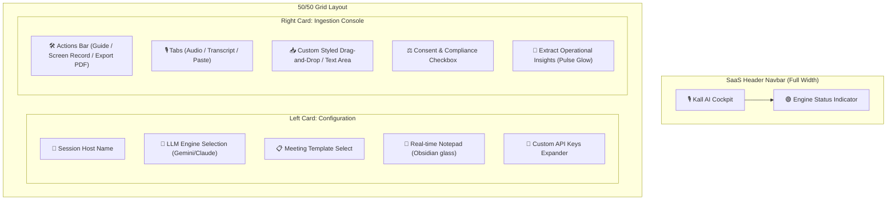

# Implementation Plan: SaaS UI/UX Visual Elevation 🚀

This plan details the design and structural upgrades to elevate the Kall AI Cockpit from a default Streamlit layout into a premium, SaaS-grade application.

---

## 🎙️ Goal Description
1. **Expose LLM Engine Selection**: Move the engine selectbox out of the hidden "Advanced Settings" expander and place it directly in the main "Session Configuration" card so users immediately know they can switch engines.
2. **Redesign Expander**: Re-label the expander to **"🔑 Add Custom API Keys"** and dedicate it solely to optional API credentials.
3. **SaaS Styling Overrides**: Inject high-fidelity CSS overrides to replace default Streamlit styling for:
   * **File Uploaders** (convert to sleek, glowing drag-and-drop landing pads).
   * **Tabs** (add indigo-glowing active pill headers and clean borders).
   * **Headers & Action Toolbar** (group the floating buttons into a cohesive header toolbar).
   * **Inputs & Textareas** (apply rounded, glowing border-active transitions).

---

## ⚠️ User Review Required: Proposed Design Layout

Here is how the layout will be restructured:



---

## 🛠️ Proposed Changes

### [Component Name] UI & Visual Style Injection

#### [MODIFY] [main_app.py](file:///Users/saurabhshidhore/Documents/Business%20Saurabh/Claude-%20Google%20Antigravity/Kall-AI-workspace/dashboard/main_app.py)

1. **Restructure HTML Layout**:
   * Move the `st.selectbox` for `engine_select` from the expander directly below the user name input in `col_left`.
   * Rename expander to `"🔑 Add Custom API Keys (Optional)"` containing only the Gemini/Claude API key password inputs.
   * Move the top actions bar (`Guide & Settings`, `Record Session`, `Export PDF` buttons) from `col_right` into a unified layout toolbar just above the input source tabs.

2. **Inject CSS Styles (around lines 487-700)**:
   * **File Uploader Overrides**:
     ```css
     [data-testid="stFileUploader"] {
         border: 2px dashed rgba(99, 102, 241, 0.3) !important;
         background: rgba(15, 23, 42, 0.4) !important;
         border-radius: 12px !important;
         padding: 20px !important;
         transition: all 0.3s ease !important;
     }
     [data-testid="stFileUploader"]:hover {
         border-color: rgba(99, 102, 241, 0.8) !important;
         box-shadow: 0 0 15px rgba(99, 102, 241, 0.15) !important;
     }
     ```
   * **Streamlit Tabs Overrides**:
     ```css
     button[data-baseweb="tab"] {
         background: rgba(15, 23, 42, 0.3) !important;
         border: 1px solid rgba(255, 255, 255, 0.05) !important;
         border-radius: 20px !important;
         padding: 8px 16px !important;
         color: #94a3b8 !important;
         margin-right: 8px !important;
         transition: all 0.2s ease !important;
     }
     button[aria-selected="true"] {
         background: linear-gradient(135deg, rgba(99, 102, 241, 0.2) 0%, rgba(79, 70, 229, 0.2) 100%) !important;
         border-color: rgba(99, 102, 241, 0.6) !important;
         color: #f8fafc !important;
         box-shadow: 0 0 10px rgba(99, 102, 241, 0.2) !important;
     }
     ```
   * **Expander Overrides**: Style the expander header bar with an obsidian tint and border, so it is obvious and looks like a button rather than a flat gray strip.

---

## 🧪 Verification Plan

### Automated Tests
* Run `venv/bin/python scratch/verify_changes.py` to check that the layout code parsing is intact.
* Run unit tests: `venv/bin/python -m unittest sample_transcripts/test_transcript_processing.py`.

### Manual Verification
1. Run Streamlit app.
2. Confirm the **LLM Engine Selectbox** is immediately visible and works.
3. Toggle the **API Keys expander** to verify behavior.
4. Verify the drag-and-drop audio/transcript file uploader and tabs styling.

---

## 🔍 Post-Deployment SEO Verification & Troubleshooting
### Diagnostic: Why Google Doesn't See Your App Yet

To guarantee that Google crawls, verifies, and indexes the landing page successfully post-deployment:

#### 1. Verification Meta Tag Preservation
Verify that the following tag is present in the `<head>` of [index.html](file:///Users/saurabhshidhore/Documents/Business%20Saurabh/Claude-%20Google%20Antigravity/Kall-AI-workspace/landing-page/index.html):
```html
<meta name="google-site-verification" content="XZZOpuVCAF5GZwdjMcw0E8GoGhycNAYKsBAvhomTVeg" />
```
*If this tag is deleted or modified during any frontend page redesign, Google Search Console will lose verification status and drop indexing.*

#### 2. Crawl Access & Sitemap Link
Ensure the following files are present in the server's root deployment directory:
* **[robots.txt](file:///Users/saurabhshidhore/Documents/Business%20Saurabh/Claude-%20Google%20Antigravity/Kall-AI-workspace/landing-page/robots.txt)**:
  ```text
  User-agent: *
  Allow: /
  Sitemap: https://kall-ai.com/sitemap.xml
  ```
* **[sitemap.xml](file:///Users/saurabhshidhore/Documents/Business%20Saurabh/Claude-%20Google%20Antigravity/Kall-AI-workspace/landing-page/sitemap.xml)**:
  Make sure it is populated with `https://kall-ai.com/` and the latest publication/update date.

#### 3. Search Engine Submission Checklist
1. Access the **Google Search Console** dashboard for the verified site.
2. Use the **URL Inspection** tool on `https://kall-ai.com/`.
3. If the page is not found or is marked as crawled/not indexed, click **Request Indexing**.
4. Submit the Sitemap URL: `https://kall-ai.com/sitemap.xml` under the **Sitemaps** settings tab to trigger an active crawl of all listed pages.

---

## 🗺️ Visual Roadmap Flowchart (Status as of Version 7)


### Mermaid Flowchart Code

```mermaid
graph TD
    %% Define Styles
    classDef done fill:#1e293b,stroke:#34d399,stroke-width:2px,color:#f8fafc;
    classDef current fill:#1e1b4b,stroke:#818cf8,stroke-width:2px,color:#f8fafc;
    classDef next fill:#0f172a,stroke:#475569,stroke-width:1px,color:#94a3b8;

    subgraph Completed["✅ Completed Milestones"]
        M1["Phase 1: App Core Architecture<br/>(June 8, 2026)<br/>- Streamlit Cockpit UI & configuration<br/>- Dark-mode glassmorphic theme styling<br/>- Demo transcript loader integration"]:::done
        M2["Phase 2: Resilient LLM Engines<br/>(June 9, 2026)<br/>- Dual provider support (Gemini & Claude)<br/>- Gemini fallback loop (2.5-Pro -> Flash -> 3.1-Lite)<br/>- Custom in-memory key overrides & validation"]:::done
        M3["Phase 3: Audio & Parser Pipeline<br/>(June 10, 2026)<br/>- Native large audio uploads (Gemini Files API)<br/>- Regex-based inline speaker timeline parser<br/>- Dynamic analytics dashboard widgets"]:::done
        M4["Phase 4: Safeguards & UI Polish<br/>(June 11, 2026)<br/>- Engine capability markers (Audio & Text vs Text Only)<br/>- Audio upload auto-toggle to Gemini safety check<br/>- Swapped API keys layout & expanded demo script"]:::done
        M5["Phase 5: Native Audio Processing<br/>(June 17, 2026)<br/>- Resumable background uploads for large audio files<br/>- Unified Drag-and-Drop audio uploader tabs<br/>- Temporary storage safety controls & deletion handlers"]:::done
        M6["Phase 6: Meeting Templates & Notepad Upgrade<br/>(June 20, 2026)<br/>- Consolidated 1:1 and General Business templates<br/>- Responsive, color-coded dashboard layouts<br/>- PDF & Markdown export compiler alignment"]:::done
        M7["Phase 7: Google Search Console & Technical SEO<br/>(June 22, 2026)<br/>- Verified domain ownership via HTML meta tags<br/>- Deployed standard sitemap.xml & robots.txt<br/>- Requested manual indexing on GSC to bypass typo-filter"]:::done
    end

    subgraph Pipeline["🚀 Upcoming Pipeline"]
        N1["Phase 8: Jira Synchronization (Up Next)<br/>- Jira OAuth authentication setup<br/>- Pydantic backlog-to-issue field mapper<br/>- One-click bulk Jira task creation"]:::current
        N2["Phase 9: Integrations & Sharing<br/>- Slack alert notifications for backlog items<br/>- ICS calendar generation for meeting dates<br/>- Secure offline HTML report exports"]:::next
        N3["Phase 10: Advanced PM Analytics<br/>- Team velocity prediction models<br/>- Long-term dashboard cohort tracking<br/>- Cross-meeting operational review trends"]:::next
    end

    M1 --> M2
    M2 --> M3
    M3 --> M4
    M4 --> M5
    M5 --> M6
    M6 --> M7
    M7 ==> N1
    N1 --> N2
    N2 --> N3
```


## 🛠️ Roadmap Specifications

| Phase | Title | Scope & Details | Status | Completed Date |
| :--- | :--- | :--- | :--- | :--- |
| **Phase 1** | App Core Architecture | Streamlit Cockpit UI & configuration | **Complete** | June 8, 2026 |
| **Phase 2** | Resilient LLM Engines | Dual provider support (Gemini & Claude) | **Complete** | June 9, 2026 |
| **Phase 3** | Audio & Parser Pipeline | Native large audio uploads (Gemini Files API) | **Complete** | June 10, 2026 |
| **Phase 4** | Safeguards & UI Polish | Engine capability markers (Audio & Text vs Text Only) | **Complete** | June 11, 2026 |
| **Phase 5** | Native Audio Processing | Resumable background uploads for large audio files | **Complete** | June 17, 2026 |
| **Phase 6** | Meeting Templates & Notepad Upgrade | Consolidated 1:1 and General Business templates | **Complete** | June 20, 2026 |
| **Phase 7** | Google Search Console & Technical SEO | Verified domain ownership via HTML meta tags | **Complete** | June 22, 2026 |
| **Phase 8** | Jira Synchronization | Jira OAuth authentication setup | **Up Next** | Planned |
| **Phase 9** | Integrations & Sharing | Slack alert notifications for backlog items | Planned | Planned |
| **Phase 10** | Advanced PM Analytics | Team velocity prediction models | Planned | Planned |

