# Kall AI — Product Development Roadmap

This document maps out the completed milestones and upcoming pipeline features for the Kall AI Meeting Summarizer. 

> [!TIP]
> **Importing to Draw.io / diagrams.net:**
> 1. Copy the code block under the **Mermaid Flowchart Code** section below.
> 2. Go to [app.diagrams.net](https://app.diagrams.net/).
> 3. Click **Arrange** > **Insert** > **Advanced** > **Mermaid...** in the top menu.
> 4. Paste the code and click **Insert** to generate an editable visual flowchart!

---

## 🗺️ Visual Flowchart

```mermaid
graph TD
    %% Define Styles
    classDef done fill:#1e293b,stroke:#34d399,stroke-width:2px,color:#f8fafc;
    classDef current fill:#1e1b4b,stroke:#818cf8,stroke-width:2px,color:#f8fafc;
    classDef next fill:#0f172a,stroke:#475569,stroke-width:1px,color:#94a3b8;

    subgraph Completed["✅ Completed Milestones"]
        M1["Phase 1: App Core Architecture<br/>(June 8, 2026)<br/>- Streamlit Cockpit UI & configuration<br/>- Dark-mode glassmorphic theme styling<br/>- Demo transcript loader integration"]:::done
        
        M2["Phase 2: Resilient LLM Engines<br/>(June 9, 2026)<br/>- Dual provider support (Gemini & Claude)<br/>- Gemini fallback loop (2.5-Pro -> Flash -> 3.1-Lite)<br/>- Custom in-memory key overrides & validation"]:::done
        
        M3["Phase 3: Audio & Parser Pipeline<br/>(June 10, 2026)<br/>- Native large audio uploads (Gemini Files API)<br/>- Regex-based inline speaker timeline parser<br/>- Dynamic analytics dashboard widgets"]:::done
        
        M4["Phase 4: Safeguards & UI Polish<br/>(June 11, 2026)<br/>- Engine capability markers (Audio & Text vs Text Only)<br/>- Audio upload auto-toggle to Gemini safety check<br/>- Swapped API keys layout & expanded demo script"]:::done

        M5["Phase 5: Native Audio Processing<br/>(June 17, 2026)<br/>- Resumable background uploads for large audio files<br/>- Unified Drag-and-Drop audio uploader tabs<br/>- Temporary storage safety controls & deletion handlers"]:::done

        M6["Phase 6: Meeting Templates & Notepad Upgrade<br/>(June 20, 2026)<br/>- Consolidated 1:1 and General Business templates<br/>- Responsive, color-coded dashboard layouts<br/>- PDF & Markdown export compiler alignment"]:::done

        M7["Phase 7: Google Search Console & Technical SEO<br/>(June 22, 2026)<br/>- Verified domain ownership via HTML meta tags<br/>- Deployed standard sitemap.xml & robots.txt<br/>- Requested manual indexing on GSC to bypass typo-filter"]:::done
    end

    subgraph Pipeline["🚀 Upcoming Pipeline"]
        N1["Phase 8: Jira Synchronization (Up Next)<br/>- Jira OAuth authentication setup<br/>- Pydantic backlog-to-issue field mapper<br/>- One-click bulk Jira task creation"]:::current
        
        N2["Phase 9: Integrations & Sharing<br/>- Slack alert notifications for backlog items<br/>- ICS calendar generation for meeting dates<br/>- Secure offline HTML report exports"]:::next
        
        N3["Phase 10: Advanced PM Analytics<br/>- Team velocity prediction models<br/>- Long-term dashboard cohort tracking<br/>- Cross-meeting operational review trends"]:::next
    end

    %% Flowchart Relationships
    M1 --> M2
    M2 --> M3
    M3 --> M4
    M4 --> M5
    M5 --> M6
    M6 --> M7
    M7 ==> N1
    N1 --> N2
    N2 --> N3
```



---

## 🛠️ Roadmap Specifications

| Phase | Title | Scope & Details | Status | Completed Date |
| :--- | :--- | :--- | :--- | :--- |
| **Phase 1** | App Core Architecture | Initial cockpit interface, template selectors, session states, and dark-theme configurations. | **Complete** | June 8, 2026 |
| **Phase 2** | Resilient LLM Engines | Implemented robust Gemini Pro-to-Flash-to-Lite quota fallback loop, Claude integrations, and custom key validations. | **Complete** | June 9, 2026 |
| **Phase 3** | Audio & Parser Pipeline | Added multi-hour raw audio file support, lookbehind regex speaker parser, and interactive speaker stats charts. | **Complete** | June 10, 2026 |
| **Phase 4** | Safeguards & UI Polish | Added engine capability markers, automatic engine toggle switches, key reordering, and a detailed 9-turn demo transcript. | **Complete** | June 11, 2026 |
| **Phase 5** | Native Audio Processing | Direct mp3/wav parsing via Google Files API, resumable background uploads, and local temp-file cleanup safety triggers. | **Complete** | June 17, 2026 |
| **Phase 6** | Meeting Templates Upgrade | Upgraded select templates, added 1:1 and General syncs, and styled responsive split layouts. | **Complete** | June 20, 2026 |
| Phase 7 | **Google Search Console & SEO** | Verified ownership on GSC, deployed robots.txt and sitemap.xml, and requested manual index. | **Complete** | June 22, 2026 |
| Phase 8 | **Jira Sync** | Connect to Jira API to push generated sprint backlogs directly into projects as active issues. | **Up Next** | Planned |
| Phase 9 | Integrations & Sharing | Deliver notifications to Slack channels, export summaries, and add calendar links. | **Planned** | Planned |
| Phase 10 | Advanced PM Analytics | Compare multiple historical meetings to track velocity, action-item completion rates, and backlog trends. | **Planned** | Planned |

---

## 🔍 Diagnostic: Why Google Doesn't See Your App Yet

If the application is not showing up on Google search results after deployment, use this roadmap checklist to diagnose and resolve indexing latency:

### 1. Verification & Identity
* **Google Verification Meta Tag**: Verify that `<meta name="google-site-verification" content="XZZOpuVCAF5GZwdjMcw0E8GoGhycNAYKsBAvhomTVeg" />` is still present in the `<head>` of [index.html](file:///Users/saurabhshidhore/Documents/Business%20Saurabh/Claude-%20Google%20Antigravity/Kall-AI-workspace/landing-page/index.html). If this is removed during a layout redesign, Google will lose verification and drop site indexing.

### 2. Crawlability & Indexability Checks
* **Robots.txt Configuration**: Confirm [robots.txt](file:///Users/saurabhshidhore/Documents/Business%20Saurabh/Claude-%20Google%20Antigravity/Kall-AI-workspace/landing-page/robots.txt) correctly declares the sitemap location and allows all user agents:
  ```text
  User-agent: *
  Allow: /
  Sitemap: https://kall-ai.com/sitemap.xml
  ```
* **Sitemap XML Validity**: Check that [sitemap.xml](file:///Users/saurabhshidhore/Documents/Business%20Saurabh/Claude-%20Google%20Antigravity/Kall-AI-workspace/landing-page/sitemap.xml) is valid, references `https://kall-ai.com/`, and has been updated with the latest deployment date.
* **Noindex Audit**: Ensure no development/test configurations have left `<meta name="robots" content="noindex">` tags active in the HTML markup.
* **Canonical Header**: Ensure `<link rel="canonical" href="https://kall-ai.com/" />` points search engines to the preferred domain representation.

### 3. Latency & Verification Actions
* **Manual Index Request**: Log into the Google Search Console dashboard, enter `https://kall-ai.com/` in the URL Inspection tool, and click **Request Indexing**. This forces Google's crawler queue to process the site immediately, bypassing potential low-traffic filter delays.
